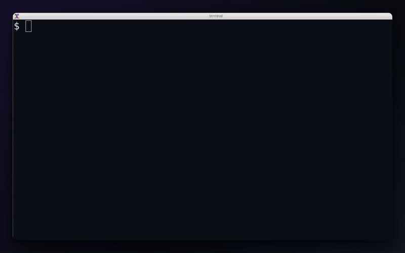

# browser-web3-signer

[](https://github.com/nikicat/browser-web3-signer/actions/workflows/ci.yml)
[](https://crates.io/crates/browser-web3-signer)
[](https://www.npmjs.com/package/browser-web3-signer)
[](https://pkg.go.dev/github.com/nikicat/browser-web3-signer/go)
[](LICENSE)

Sign EVM and TRON transactions and messages **using your own browser wallet** (MetaMask,
Rabby, TronLink, …) — from the command line, or from **Rust**, **TypeScript**, and **Go**
programs. A local page opens in your browser, you approve in your wallet, and the result
comes back. **The private key never leaves the browser** — this tool only routes the
request and reads the result back.

## How it works



*The approval flow, recorded against the E2E mock wallet — with a real wallet the
extension's own popup appears on top for the final confirmation.*


Each request starts (or reuses) a tiny localhost-only HTTP server, opens the browser to
an approval page, blocks until you act in your wallet (or a 5-minute timeout), and
returns the result. Nothing binds a public interface; the bridge is `127.0.0.1` only.

### Try it in 30 seconds

```sh
cargo install browser-web3-signer   # or grab a prebuilt binary from the releases page
browser-web3-signer evm connect
```

Your browser opens an approval page; approve the connection in your wallet and the CLI
prints your address. Nothing is sent on-chain — it's a zero-risk way to see the flow.

## Why?

Scripts and backend tools that need a real signature usually get one by holding a raw
private key — a `PRIVATE_KEY` env var, a keystore file. That's exactly the thing you
don't want sitting in shell history, CI logs, or an agent's sandbox. This tool flips
it: the program *asks*, **you approve in the wallet you already use**, and only the
result (address, signature, tx hash) comes back.

Good fits:

- **Deploy & ops scripts** — send an admin transaction from a runbook or release script
  without provisioning a hot key; a human approves each operation.
- **AI agents & automation** — let an agent prepare transactions while a human stays the
  signing authority, approving in their own wallet.
- **Local dev tooling** — sign with the account you already use in the browser, no key
  export, no separate test identity.

How it compares:

| Alternative | Difference |
| --- | --- |
| Raw key in env / keystore (viem, ethers, `cast`, web3.py) | Key material lives in your shell or CI, and anything holding it can sign silently. Here the key stays in the wallet extension and every operation needs a click. |
| WalletConnect | Pairs a dapp with a (usually mobile) wallet through a network relay and a session handshake. This is a local bridge to the extension wallet already in your browser — no relay, no pairing. |
| [Frame](https://frame.sh) | A separate desktop wallet exposing a local RPC — great if you adopt Frame as your wallet. This works with the wallets you already run, and is a CLI + libraries rather than a wallet. |
| Hardware-wallet CLIs (`cast` + Ledger) | Also keeps keys out of the environment — if you have the device. This gives extension-wallet users the same property, and covers TRON. |

**Supported wallets**: any injected EVM wallet (EIP-6963 / `window.ethereum`) — developed
against MetaMask and Rabby — and TronLink for TRON. Per-wallet account-switching behavior
is source-verified and catalogued in [docs/wallet-account-change.md](docs/wallet-account-change.md).

## Interfaces

One chain-agnostic Rust core drives every interface: the CLI and the Rust crates use it
in-process; the TypeScript and Go bindings spawn it as a supervised `serve` subprocess.

| Interface | Install | Details |
| --- | --- | --- |
| [CLI](#cli) | prebuilt binary, or `cargo install browser-web3-signer` | below |
| [Rust](#rust) | `cargo add browser-web3-signer-evm` | below |
| [TypeScript](#typescript-npm) | `npm install browser-web3-signer` | [ts/](ts) |
| [Go](#go) | `go get github.com/nikicat/browser-web3-signer/go@latest` | [go/](go) |

## CLI

**Prebuilt binaries**: each [GitHub release](https://github.com/nikicat/browser-web3-signer/releases)
ships static binaries for linux x64/arm64 (musl, runs on any distro), macOS x64/arm64, and
windows x64, plus a `SHA256SUMS` file. Download `browser-web3-signer-<target>`, verify, `chmod +x`.

**crates.io** — requires a Rust toolchain:

```sh
cargo install browser-web3-signer
```

**From source** (pinned to Rust 1.95 via `rust-toolchain.toml`): `cargo build --release`,
binary at `target/release/browser-web3-signer`.

### Usage

```sh
browser-web3-signer <evm|tron> <command> [flags]
```

Global flags (any command): `--browser <name>` (open a specific browser instead of the
default), `--print` (print the approval URL but don't open a browser), `--json` (machine-
readable JSON on stdout; human text otherwise). Progress/prompts go to stderr, results to
stdout.

#### EVM

```sh
browser-web3-signer evm connect --chain 1
browser-web3-signer evm send-transaction --to 0x… --value 1000000000000000 --chain 1
browser-web3-signer evm sign-message --message "hello"
browser-web3-signer evm sign-typed-data --file ./typed-data.json    # {domain,types,primaryType,message}
```

Built-in chains: Ethereum (1), Sepolia (11155111), Polygon (137), Arbitrum (42161),
Optimism (10), Base (8453), Avalanche (43114), BNB Smart Chain (56). `--value` and the
fee flags are in wei.

#### TRON

```sh
browser-web3-signer tron connect
browser-web3-signer tron send-transaction --to T… --amount 1000000          # SUN (1 TRX = 1e6 SUN)
browser-web3-signer tron trigger-contract --contract T… --selector 'transfer(address,uint256)' \
    --params '[{"type":"address","value":"T…"},{"type":"uint256","value":"1"}]'
browser-web3-signer tron sign-message --message "hello"
browser-web3-signer tron deploy-contract --abi-file ./abi.json --bytecode 0x…
```

Networks: `mainnet`, `shasta`, `nile`. Signing and transaction building happen browser-side
in TronLink's `tronWeb`; the Rust side only routes requests.

#### Serve (control API for language bindings)

```sh
browser-web3-signer serve --chain evm     # prints the bound port, then blocks
```

Runs the bridge on a stable port for the process lifetime and exposes `POST /api/v1/request`
(body is a request `{type, …}`; opens the wallet, blocks, returns `{success, result}` or
`{success:false, error, code?}`) and `GET /api/v1/health`. This is what the TypeScript and Go
bindings spawn and drive over HTTP; a binding for any other language is a subprocess + two
endpoints away. Honors the global `--browser` / `--print` flags for how the approval page opens.

#### Remote / headless machines

The bridge binds localhost on the machine running the command, but the approval can happen
in the browser on your desk: pass `--print`, forward the port, and open the printed URL
locally:

```sh
ssh -L 3847:127.0.0.1:3847 myserver
# on myserver:
browser-web3-signer evm sign-message --message "hello" --print
# on your laptop: open the printed http://127.0.0.1:3847/sign/<id> URL and approve
```

## Rust

Published as four crates:
[`browser-web3-signer-core`](https://crates.io/crates/browser-web3-signer-core) (chain-agnostic
engine: pending-request store, HTTP bridge, browser launcher),
[`browser-web3-signer-evm`](https://crates.io/crates/browser-web3-signer-evm) and
[`browser-web3-signer-tron`](https://crates.io/crates/browser-web3-signer-tron) (typed signers +
embedded approval UI per chain), and
[`browser-web3-signer`](https://crates.io/crates/browser-web3-signer) (the CLI binary).
Programs depend on the chain crate(s); the core types a signer's API surfaces
(`BrowserChoice`, `BindPort`, `SignerError`, …) are re-exported, and the API is async:

```sh
cargo add browser-web3-signer-evm tokio
```

```rust
use browser_web3_signer_evm::{BrowserChoice, EvmSigner, SendTransactionParams};

#[tokio::main]
async fn main() -> Result<(), Box<dyn std::error::Error>> {
    // Env-driven config (port, default chain); each call opens the wallet and
    // blocks until you approve (or reject) in the browser.
    let signer = EvmSigner::from_env(BrowserChoice::Default);

    let address = signer.connect_wallet(None, None).await?;
    let signature = signer.sign_message("hello".into(), None, None).await?;
    let tx_hash = signer
        .send_transaction(SendTransactionParams {
            to: "0x…".parse()?,
            value: Some("1000000000000000".parse()?), // wei
            from: None,
            data: None,
            chain_id: None,
            gas_limit: None,
            max_fee_per_gas: None,
            max_priority_fee_per_gas: None,
        })
        .await?;

    signer.shutdown().await;
    Ok(())
}
```

`TronSigner` in `browser-web3-signer-tron` is the TRON counterpart (send-TRX,
trigger/deploy contract, message + TIP-712 signing). For persistent sessions, hold one
signer and reuse it: it keeps the same stable port and connected tab, so the wallet skips
the reconnect prompt across calls. A rejection surfaces as a typed `SignerError` with the
error code preserved. Extension points (mounting extra routes on the bridge, preparing a
request without opening a browser) are on `signer.engine()` — see
[ARCHITECTURE.md](ARCHITECTURE.md).

## TypeScript (npm)

```sh
npm install browser-web3-signer   # pulls the right platform binary as an optionalDependency
```

No Rust toolchain needed: the binary ships as prebuilt per-platform npm packages
(`@nikicat/browser-web3-signer-<platform>`, the esbuild pattern). The client spawns and
supervises the `serve` subprocess for its lifetime; construct one and reuse it.

```ts
import { WalletSignerClient, connectWalletViem } from "browser-web3-signer";

const signer = new WalletSignerClient("evm", { defaultChainId: 1 });

const address = await signer.connectWallet();
const hash = await signer.sendTransaction({ to: "0x…", value: "1000000000000000000" });
const sig = await signer.signMessage({ message: "hello" });

// Or drive it through viem: a hybrid account + transport over the same signer.
const { account, transport } = await connectWalletViem(signer);

await signer.shutdown(); // kill the subprocess when done
```

TRON works the same way (`new WalletSignerClient("tron")`). Binary resolution order, the
viem transport/account details, and error semantics: [ts/README.md](ts/README.md).

## Go

```sh
go get github.com/nikicat/browser-web3-signer/go@latest   # versioned via go/vX.Y.Z tags
```

```go
import (
    "context"

    signer "github.com/nikicat/browser-web3-signer/go"
)

func main() {
    ctx := context.Background()

    evm := signer.NewEVMClient(signer.ClientOptions{DefaultChainID: 1})
    defer evm.Shutdown()

    addr, err := evm.Connect(ctx, signer.EVMConnectParams{})
    hash, err := evm.SendTransaction(ctx, signer.EVMSendTxParams{To: "0x…", Value: "1000000000000000"})
    sig, err := evm.SignMessage(ctx, signer.EVMSignMessageParams{Message: "hello"})
    _, _, _, _ = addr, hash, sig, err
}
```

`NewTronClient` is the TRON counterpart. Results are go-ethereum types (`common.Address`,
`common.Hash`, `hexutil.Bytes`); every operation takes a `context.Context`; coded errors
surface as typed values (`WrongWalletAddressError`). The client needs the
`browser-web3-signer` binary — resolved from `ClientOptions.BinPath`, then
`BROWSER_WEB3_SIGNER_BIN`, then `PATH` (grab a prebuilt one from the
[releases page](https://github.com/nikicat/browser-web3-signer/releases)). Details:
[go/README.md](go/README.md).

## Configuration (env)

All interfaces read the same environment variables:

| Variable | Default | Meaning |
| --- | --- | --- |
| `BROWSER_WEB3_EVM_PORT` | `3847` | Preferred bridge port for EVM |
| `BROWSER_WEB3_EVM_CHAIN` | `1` | Default EVM chain id |
| `BROWSER_WEB3_TRON_PORT` | `3848` | Preferred bridge port for TRON |
| `BROWSER_WEB3_TRON_NETWORK` | `mainnet` | Default TRON network |
| `BROWSER` | — | Browser binary to open (else OS default) |
| `BROWSER_WEB3_SIGNER_BIN` | — | Explicit signer-binary path for the language bindings |

The port is *preferred*, not mandatory: if it's already in use (a concurrent command, or a
daemon), the command falls back to an OS-assigned ephemeral port instead of failing.

## Security model

- **No key material, ever.** The tool prepares a request, opens an approval page, and
  reads back the result. Signing happens inside your wallet extension — there are no seed
  phrases, keystores, or keys in the process, its config, or its logs.
- **Explicit approval per operation.** Every connect, signature, and transaction requires
  a click in the wallet, exactly like a dapp. The bridge itself is unauthenticated, so any
  process on your machine can *submit* a request — but nothing can be signed silently: the
  wallet prompt is the gate.
- **Localhost only.** The bridge binds `127.0.0.1` exclusively, never `0.0.0.0`. Approval
  URLs have the shape `http://127.0.0.1:<port>/<connect|sign>/<id>` where `<id>` is a
  random UUIDv4 per request.
- **Bounded lifetime.** A request expires after 5 minutes; expired, rejected, and
  completed requests are removed from the bridge and surface as typed results to the
  caller. The one-shot CLI tears the bridge down when the command exits, and the `serve`
  process is a child owned and supervised by the binding that spawned it. A long-lived
  multi-client daemon (discovery file, bearer-token auth, request queue) is deliberately
  deferred — see the [roadmap](ARCHITECTURE.md#roadmap).
- **What it can't protect**: a compromised browser or wallet extension, or approving a
  transaction you didn't read. Check what the wallet shows before you click.

## Development

```sh
just            # list recipes
just ci         # fmt + taplo + clippy + build + test (what CI runs)
just test
just lint       # clippy -D warnings
just coverage   # cargo-llvm-cov summary
```

`cargo`/`taplo`/`clippy` are pinned and gated by CI and a `prek` pre-commit hook
(`.pre-commit-config.yaml`). See [ARCHITECTURE.md](ARCHITECTURE.md) for the design and the
rationale behind the key decisions.

**E2E browser tests**: a Playwright suite drives a mock wallet against the real Rust bridge
for both EVM and TRON — connect, sign, send/trigger/deploy, reject, cancel, address
mismatch — on every push and PR. Run with `just e2e-setup && just e2e`.

**Manual real-wallet tests**: scripted walkthroughs drive your *real* wallet extension
against a throwaway local chain (anvil for EVM, a `tronbox/tre` Docker node for TRON) and
verify every result on-chain — no testnet, no real funds. See
[docs/manual-testing.md](docs/manual-testing.md).

## Status

All four interfaces cover **EVM and TRON** end to end: connect, send/trigger/deploy,
message + typed-data signing, with an embedded approval UI per chain. Releases are
lockstep across the GitHub binaries, crates.io, npm, and the Go module tag.

Deferred: a full multi-client daemon (discovery file, auth, request queue, SSE), warranted only if
several independent processes must share one connected tab. See
[ARCHITECTURE.md](ARCHITECTURE.md#roadmap).

## Related projects

browser-web3-signer is a Rust reimplementation of the browser-signing capability of
[mcp-wallet-signer](https://github.com/nikicat/mcp-wallet-signer) (a Deno/TS MCP server,
now superseded by this project), without the MCP layer.

## License

MIT — see [LICENSE](LICENSE).
